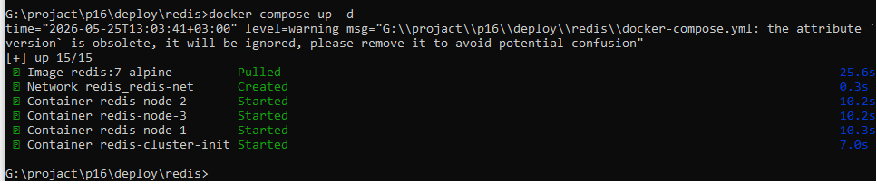
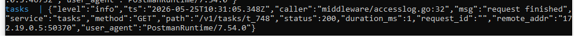
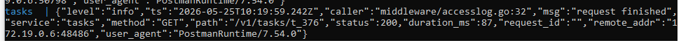
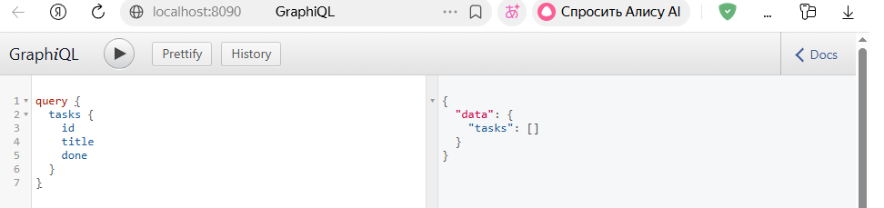
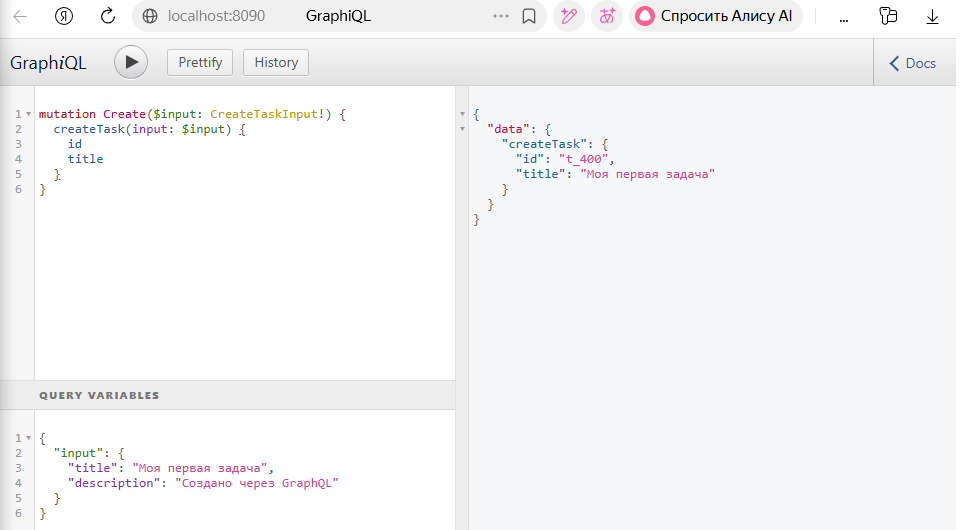
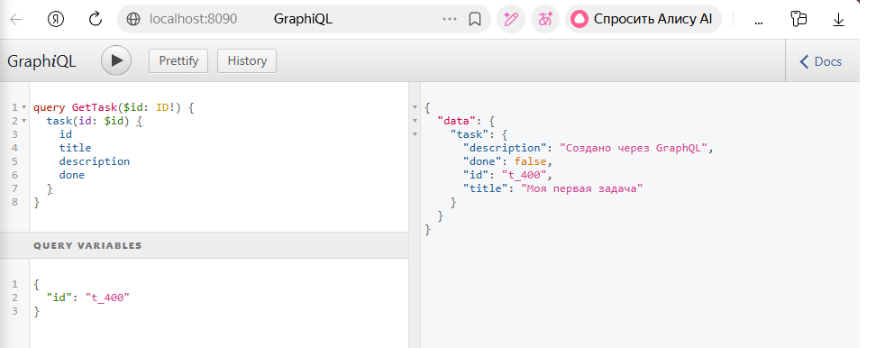
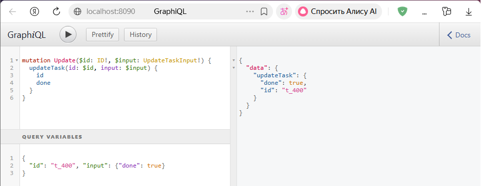

# Выполнил: Студент ЭФМО-02-25 Фомичев Александр Сергеевич

## Структура проекта после всех изменений

```
.github
    workflows
        ci.yml
bin
    tasks.exe
    auuth.exe
deploy
    monitoring
        prometheus.yml
        docker-compose.yml
    tls
        docker-compose.yml
        nginx.conf
        init.sql
        cert.pem
        key.pem 
services
    graphql
        cmd
            graphql
                main.go 
        graph
            schema.go
            schema.graphqls 
        go.mod
        gqlgen.yml 
    auth
        Dockerfile
        cmd
            auth
                main.go
        internal
            grpc
                server.go
            http
                handlers
                    login.go
                    verify.go
                routes.go
            service
                auth_test.go
                auth.go
    tasks
        Dpkerfile
        cmd
            tasks
                main.go
        internal
            metrics
                metrics.go
            grpcclient
                client.go
            http
                middleware
                    csrf.go
                    metrics.go
                handlers
                    tasks_test.go
                    tasks.go
                    middleware
                        auth.go
                routes.go
            repository
                caching_repo.go
                postgres_task_repo.go
                task_repo.go
            service
                tasks.go
shared
    shared
        logger
            logger.go 
    middleware
        security.go
        requestid.go
        accesslog.go
        grpclog.go
    httpx
        client.go
pkg
    api
        auth
            v1
                auth.proto
                auth.pb.go
                auth_grpc.pb.go
docs
    pz17_api.md
.dockerignore
README.md
go.mod
go.sum
```
# Практическое занятие №9: Распределённый кэш (Redis cluster)

## Ключи кэша и их формирование  
Используется ключ `tasks:task:<id>`. Формируется конкатенацией префикса и идентификатора задачи.

## Реализация cache-aside  
- Сначала пытаемся прочитать из Redis.  
- При промахе обращаемся в БД.  
- Полученный объект сохраняем в Redis с TTL.  
- При обновлении/удалении задачи инвалидируем соответствующий ключ.

## TTL и jitter 
Базовый TTL = 120 секунд, jitter = 30 секунд. Итоговый TTL = 120 + rand(0..30). Это предотвращает «cache avalanche» (одновременное истечение множества ключей).

## Инвалидация  
При PATCH и DELETE вызывается `InvalidateTask(id)`, которая удаляет ключ из Redis.

## Деградация при недоступности Redis
Если Redis не отвечает, ошибки логируются, но сервис продолжает работу напрямую с БД. При инициализации, если Redis недоступен, кэш не используется, сервис работает без него.

## Команды запуска и проверки  

**pзапуск**
```bash
cd deploy/redis
docker compose up -d
cd ../tls
docker compose up -d
```
примеры запросов до/после (hit/miss). если duration_ms = 1-20 то это hit, если duration_ms = 50-100 то это miss

**пример запуска redis**

****

**пример hit**
****

**пример miss**
****

# Практическое занятие №10: Горизонтальное масштабирование (Load Balancer NGINX)

## Количество реплик и их конфигурация  
Запущены две реплики tasks_1 и tasks_2. Каждая имеет переменную окружения `INSTANCE_ID` (tasks-1 / tasks-2). Сервис добавляет заголовок `X-Instance-ID` в ответ.

## Конфигурация NGINX 
Upstream `tasks_backend` с двумя серверами, балансировка round‑robin. Проксируются заголовки `Authorization`, `X-Request-ID`.

## Health endpoint  
`GET /health` → `{"status":"ok"}`. Используется для проверки готовности.

## Демонстрация распределения запросов  

Вывод чередуется между tasks-1 и tasks-2.

## Отказоустойчивость**  
Останавливаем одну реплику (`docker compose stop tasks_1`) – запросы продолжают идти на tasks_2 без ошибок.

# Практическое занятие №11 GraphQL API (gqlgen)

**1. Схема GraphQL** – описана в `schema.graphqls`. Тип Task с полями id, title, description, done. Query: tasks (список) и task(id). Mutation: createTask, updateTask, deleteTask.

**2. Резолверы** – в `resolver.go`. Они напрямую работают с PostgreSQL (общий источник данных с REST tasks). Генерация выполнена командой `go run github.com/99designs/gqlgen init`.

**3. Примеры запросов**
****
****
****
****
**4. Инструкция запуска**  
```bash
cd services/graphql
export GRAPHQL_PORT=8090
export DB_HOST=localhost DB_PORT=5432 DB_USER=postgres DB_PASSWORD=postgres DB_NAME=tasksdb
go run ./cmd/graphql
```

#  Практическое занятие №12 Сравнение REST и GraphQL

**Сценарий**: экран списка задач (нужны id, title, done) и детали задачи (id, title, description, done) + действие "создать задачу".

**REST**:
- GET /v1/tasks → получаем массив, но ответ включает все поля (description, due_date и т.д.) – over‑fetching.
- GET /v1/tasks/{id} → тоже получаем все поля.
- POST /v1/tasks → создание.

**GraphQL**:
- Один запрос: `query { tasks { id title done } }` – получаем только нужные поля.
- Детали: `query($id:ID!){ task(id:$id){ id title description done } }` – точно нужные поля.
- Мутация: `mutation($input:CreateTaskInput!){ createTask(input:$input){ id } }`.

**Сравнение**:

| Критерий                | REST                                      | GraphQL                                  |
|-------------------------|-------------------------------------------|------------------------------------------|
| Количество запросов     | 2 (список + детали) или 1 (только список) | 2 (разные запросы) или 1 (если вложить)  |
| Объём данных            | Избыточный (лишние поля)                  | Только запрошенные поля                  |
| Ошибки                  | HTTP статусы (200, 404, 500)              | Всегда 200, ошибки в поле `errors`       |
| Кэширование             | Простое (по URL)                          | Сложное, нужны persisted queries         |
| Гибкость                | Низкая (фиксированные DTO)                | Высокая (клиент выбирает поля)           |

**Вывод**: REST удобен для простых сценариев с фиксированным набором полей и при необходимости кэширования. GraphQL оправдан при сложных UI с разными наборами полей, множественных вложенных запросах, и когда важна минимизация трафика. В учебном проекте GraphQL даёт более чистый интерфейс для фронтенда.

# Практическое занятие №13: RabbitMQ (базовое)

**1. Запуск RabbitMQ** – `docker-compose up -d` в `deploy/rabbit`. Порты: 5672 (AMQP), 15672 (Management UI).

**2. Формат сообщения** – JSON: `{"event":"task.created","task_id":"t_001","ts":"..."}`.

**3. Публикация** – происходит после успешного создания задачи в БД (best effort – при ошибке логируем, но не возвращаем 500).

**4. Consumer** – worker подключается, объявляет durable очередь, устанавливает prefetch=1, читает сообщения, логирует и отправляет ack.

**5. Демонстрация** – создаём задачу через curl, в логах worker видим событие.

# Практическое занятие №14: Очередь задач с retries, DLQ, идемпотентностью

**1. Очереди** – основная `task_jobs`, DLQ `task_jobs_dlq`. Обе durable.

**2. Формат сообщения** – включает `job`, `task_id`, `attempt`, `message_id` (для идемпотентности).

**3. Retry политика** – максимум 3 попытки. При временной ошибке увеличивается `attempt` и сообщение переотправляется (вариант A). При превышении – отправляется в DLQ.

**4. Идемпотентность** – на основе `message_id` хранится в `map` (в памяти) в consumer'е. При повторной доставке игнорируется.

**5. Демонстрация** – вызов `POST /v1/jobs/process-task` с `{"task_id":"t_fail"}` приводит к трем попыткам, затем сообщение попадает в DLQ. Успешное задание (`t_001`) обрабатывается один раз.

# Практическое занятие №15: Деплой на VPS с systemd

**1. VPS** – IP скрыт, подключение по SSH выполнено.

**2. Структура директорий** – бинарник в `/opt/tasks/tasks`, конфиг в `/etc/tasks/tasks.env`.

**3. systemd unit** – секции `Unit`, `Service`, `Install`. Ключевые параметры: `Restart=always`, `EnvironmentFile`, `User=tasksuser`.

**4. Статус** – `sudo systemctl status tasks` показывает активный (running).

**5. Логи** – `journalctl -u tasks -n 30` отображает последние логи.

**6. Health endpoint** – curl возвращает `{"status":"ok"}`.

**7. Обновление** – остановить сервис, заменить бинарник, запустить. Откат аналогичен.

# Практическое занятие №16: Деплой в Kubernetes (minikube)

**1. Kubernetes стенд** – minikube на локальной машине. `kubectl` настроен.

**2. Образ** – используется образ из GitHub Container Registry (собран в CI). Доступ к registry настроен через `imagePullSecrets` (при необходимости).

**3. Манифесты**:
- ConfigMap – хранит несекретные параметры окружения.
- Deployment – 1 реплика, образ, probes (readiness + liveness), порт 8082.
- Service – ClusterIP для внутреннего доступа.

**4. Применение** – `kubectl apply -f ...`. Pod запущен.

**5. Доступ** – через port-forward: `kubectl port-forward svc/tasks 8082:8082`. curl на `/health` успешен.

**6. Масштабирование** – `kubectl scale deployment tasks --replicas=2` – поднимаются два пода.

